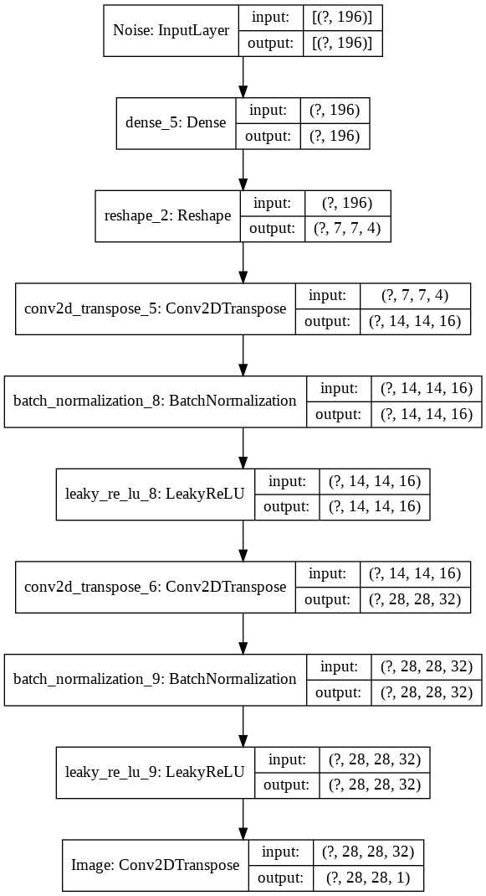
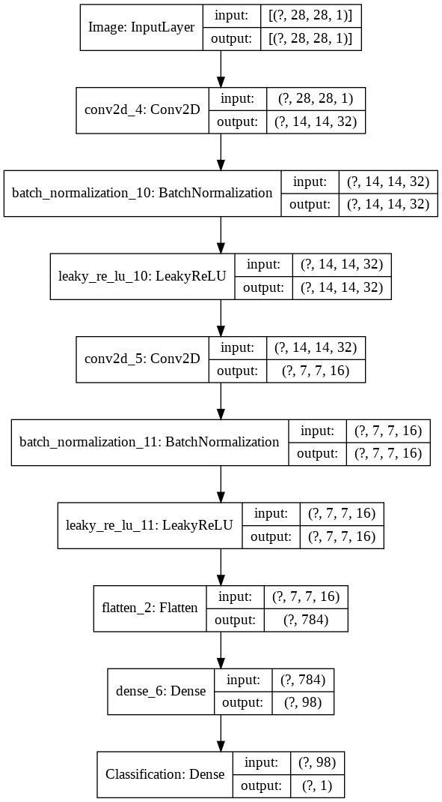

# IntSys19

## Contents

* [Setup](https://github.com/MScharnberg/IntSys19/tree/documentation#setup)
  * Getting started
  * Requirements
* [Data](https://github.com/MScharnberg/IntSys19/tree/documentation#data)
  * Choose dataset 
  * Load dataset
  * Explore dataset
  * Preprocess dataset
  * Visualize dataset
* [Model](https://github.com/MScharnberg/IntSys19/tree/documentation#model)
  * Choose model 
  * Compile model
  * Explore model
  * Train model
  * Evaluate model
* [Deployment](https://github.com/MScharnberg/IntSys19/tree/documentation#deployment)
  * Use model
  * Export model
  * Export metrics

## Setup

### Getting started

* Option 1 (RECOMMENDED)
  * Open and run [Notebook](./Notebook.ipynb) in [CoLab](https://colab.research.google.com/) and enable runtime acceleration via [GPU](https://colab.research.google.com/notebooks/gpu.ipynb) if needed
* Option 2
  * Install requirements via `pip install -r requirements.txt` and run [Notebook](./Notebook.ipynb) on local [Jupyter Notebook](https://jupyter.org/) Server
* Option 3
  * Install requirements via `pip install -r requirements.txt` and run [Script](./script.py) on local console

### Requirements

| Package             | Version |
|:--------------------|--------:|
| NumPy               | 1.18    |
| TensorFlow          | 2.2.0   |
| TensorFlow Datasets | 2.1.0   |
| TensorBoard         | 2.2.0   |

## Data

### Choose dataset 

* [MNIST](http://yann.lecun.com/exdb/mnist/) (Modified National Institute of Standards and Technology)
* [HSD Sans](https://www.hs-duesseldorf.de/hochschule/verwaltung/kommunikation/cd/faq/hsdsans)
  * Work in Progress

### Load dataset

### Explore dataset

Label distribution

### Preprocess dataset

### Visualize dataset

Real data instances

## Model

### Choose model 

* [GAN](https://arxiv.org/abs/1406.2661) (Generative Adversarial Network)
  * Generator as generative model
    * Map fake to real data distribution
    * Copy digits as close to original ones as regression problem
  * Discriminator as discriminative model
    * Distinguish fake from real data distribution
    * Differentiate between a digit's copy and original as classification problem
* [CGAN](https://arxiv.org/abs/1411.1784) (Conditional Generative Adversarial Network)
  * Work in Progress

Generative Adversarial Network

### Explore model

Generator architecture

Discriminator architecture

### Compile model

* Loss
  * Discriminator loss
  * Generator loss
* Loss metrics
  * Discriminator
  * Generator
  * Real vs. Fake
  
* Optimizer
  * [Adam](https://arxiv.org/abs/1412.6980) (Adaptive Moment Estimation)

### Train model

### Evaluate model

* Evaluation metrics
  * MSE (Mean-squared error)
  * KLD (Kullback–Leibler divergence)

## Deployment 

### Use model

Fake data instances

### Export model

### Export metrics

View exemplary hosted evaluation metrics in [TensorBoard](https://tensorboard.dev/experiment/xPmLM55lRsGE7zE9i6PZpA/)
