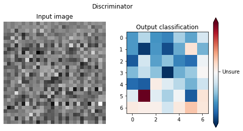

# Synthesize handwriting with GANs

## Contents

* [Intro](https://github.com/MScharnberg/IntSys19/tree/documentation#intro)
  * Getting started
  * Requirements
* [Data](https://github.com/MScharnberg/IntSys19/tree/documentation#data)
  * Constants
  * Choose dataset 
  * Load dataset
  * Explore dataset
  * Preprocess dataset
  * Visualize dataset
* [Model](https://github.com/MScharnberg/IntSys19/tree/documentation#model)
  * Parameters
  * Define model 
  * Explore model
  * Compile model
  * Train model
  * Evaluate model
* [Deployment](https://github.com/MScharnberg/IntSys19/tree/documentation#deployment)
  * Use model
  * Export model
  * Export metrics

## Intro

[This](https://github.com/MScharnberg/IntSys19) repository covers the development of deep convolutional neural networks to create fake digits based on adversarial learning techniques. Two models interact with each other in order to predict novel instances of digits. The main program is included in [this](./Train.ipynb) training notebook, whereas inference is implemented in a separate [Notebook](./Test.ipynb). 

### Getting started

* Training
  * Option 1: Open [Notebook](./Train.ipynb) in [CoLab](https://colab.research.google.com/)
  * Option 2: Install requirements via `pip install -r requirements.txt` and run [Script](./train.py) in local Python environment 
  
* Testing
  * Option 1: Open [Notebook](./Test.ipynb) in [CoLab](https://colab.research.google.com/)
  * Option 2: Install requirements via `pip install -r requirements.txt` and run [Script](./test.py) in local Python environment 

### Requirements

| Package             | Version |
|:--------------------|--------:|
| NumPy               | 1.18    |
| TensorFlow          | 2.2.0   |
| TensorFlow Datasets | 2.1.0   |
| TensorBoard         | 2.2.0   |

## Data

### Constants

| Parameter | Value |
|:-|-:|
| Batch size | 32 |
| Image dimension | 28 |
| Noise dimension | 196 |

### Choose dataset 

* [MNIST](http://yann.lecun.com/exdb/mnist/) (Modified National Institute of Standards and Technology)

### Load dataset

### Explore dataset

Label distribution

### Preprocess dataset

### Visualize dataset

Real data instances

## Model

### Parameters

| Parameter | Value | Info
|:- | -:| -|
| Depth | 5 | Number of blocks
| Epochs | X | Number of epochs to train
| Activation | ReLU, Leaky ReLU | Activation function of block
| Initialization | Normal, Xavier | Initialization values of filter mask
| Lerning rate | 0.001, 0.0001 | Learning rate of optimizer algorithm
| Normalization | Batch, Group | Normalization technique of block
| Optimizer | Adam, SGD | Optimizer algorithm

### Define layers

* Layers per block
  * Convolutional layer (as feature extractors)
  * Normalization layer
  * Activation layer

### Define model 

* [GAN](https://arxiv.org/abs/1406.2661) (Generative Adversarial Network)
  * Generator as generative model
    * Map fake to real data distribution
    * Copy digits as close to original ones as regression problem
  * Discriminator as discriminative model
    * Distinguish fake from real data distribution
    * Differentiate between a digit's copy and original as classification problem

Generative Adversarial Network

### Explore model

| Model | Parameter | Blocks |
|:- | -- | -:|
| Generator | 100,352 | 5 |
| Discriminator | 100,137 | 5 |

#### Generator

Generator pipeline

Generator architecture (visualized by [Net2Vis](https://arxiv.org/abs/1902.04394))

#### Discriminator

Discriminator pipeline

Discriminator architecture (visualized by [Net2Vis](https://arxiv.org/abs/1902.04394))

### Compile model

* Loss
  * Discriminator loss
  * Generator loss
* Loss metrics
  * Generator fake loss
  * Generator reconstruction loss
  * Discriminator fake loss
  * Discriminator real loss
  
* Optimizer
  * [Adam](https://arxiv.org/abs/1412.6980) (Adaptive Moment Estimation)
  * [SGD]() (Stochastic Gradient Descent)

### Train model

### Evaluate model

* Evaluation metrics
  * MSE (Mean-squared error)
  * KLD (Kullback–Leibler divergence)

## Deployment 

### Use model

Fake data instances

### Export metrics

View exemplary hosted evaluation metrics in [TensorBoard](https://tensorboard.dev/experiment/xPmLM55lRsGE7zE9i6PZpA/)
